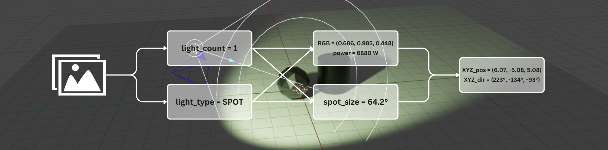
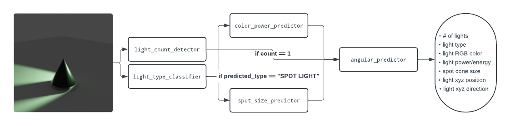
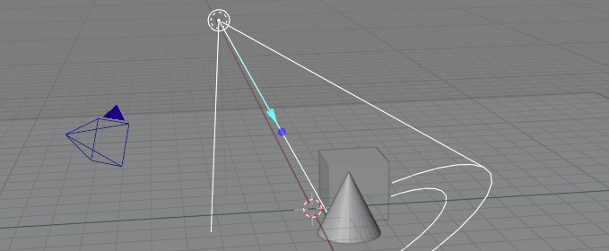
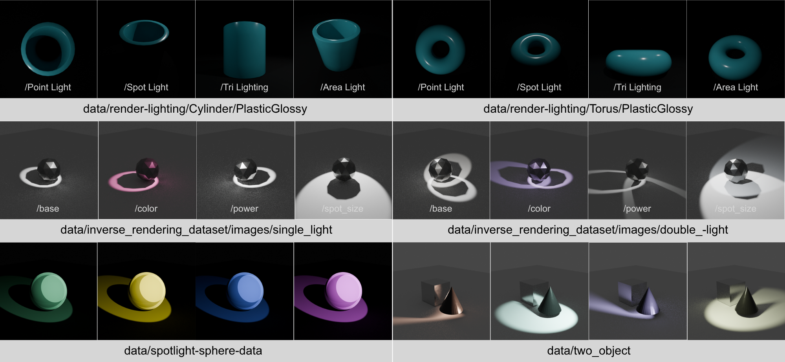
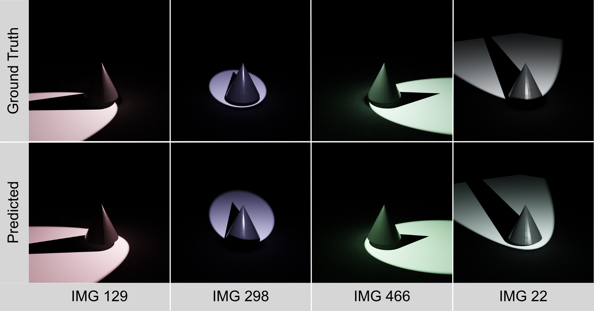

# Inverse Rendering of Scene Lighting for Theatrical Lighting Reconstruction



This repository contains a graduate-level project on reconstructing interpretable theatrical lighting from images using a synthetic inverse-rendering pipeline. Instead of representing illumination as a latent field or environment map, the system predicts a small set of discrete light sources with meaningful attributes such as light type, light count, position, direction, color, intensity, and spotlight cone angle.

The project was built around Blender-generated synthetic datasets, a modular family of neural models, and an evaluation workflow that measures both numerical accuracy and reconstruction plausibility.

## Table of Contents

- [Why this project](#why-this-project)
- [What the pipeline predicts](#what-the-pipeline-predicts)
- [Pipeline overview](#pipeline-overview)
- [Example data and reconstruction visuals](#example-data-and-reconstruction-visuals)
- [Final benchmark snapshot](#final-benchmark-snapshot)
- [Repository structure](#repository-structure)
- [Main files](#main-files)
- [Datasets included here](#datasets-included-here)
- [Models in this repo](#models-in-this-repo)
- [Quick start](#quick-start)
- [Current limitations](#current-limitations)
- [Documentation](#documentation)
- [Citation](#citation)

## Why this project

Lighting is one of the main storytelling tools in theatre. If stage-style lighting can be reconstructed directly from images in a structured form, the result can support documentation, digital previsualization, analysis, and future reconstruction of scenes.

This project asks a focused question:

Can theatrical lighting be recovered from images in a form that is both machine-predictable and usable by humans?

## What the pipeline predicts

The system breaks inverse rendering into smaller prediction tasks:
- Light count
- Light type
- Single-light position and direction in camera space
- Tri-light geometry
- RGB light color
- Light energy
- Spotlight cone angle

This staged design keeps the output interpretable and makes each sub-problem easier to debug and evaluate.

## Pipeline overview



High-level flow:
1. Generate synthetic scenes in Blender with controlled object, material, camera, and lighting variation.
2. Export structured metadata with exact lighting and camera labels.
3. Train specialized models for scene structure, geometry, and photometric prediction.
4. Route inference through the appropriate predictors and merge outputs into one lighting record.
5. Evaluate predictions against held-out ground truth and compare qualitative reconstructions.

## Example data and reconstruction visuals
### Blender scene setup example


### Dataset samples


### Tested ground truth vs predicted lighting


## Final benchmark snapshot

The final held-out benchmark contains 500 Blender-generated spotlight images with controlled variation in lighting parameters.
- Light type accuracy: `100%`
- Light count exact accuracy: `99.6%`
- Direction angular MAE: `21.81°`
- Position mean L2 error: `1.72`
- RGB mean L2 error: `0.261`
- Energy MAE: `2055.13`
- Spot size MAE: `10.55°`
- Overall pipeline score: `86.35`
- Prediction coverage: `99.89%`

The main result is that coarse lighting structure is recovered very reliably, while exact geometric and photometric parameter recovery remains more difficult.

## Repository structure
```text
.
├── data/                      Synthetic datasets and metadata
├── docs/                      Project-support documentation and diagrams
├── legacy/                    Earlier experiments and archived models
├── models/                    Trained model files and training notebooks
├── processing/                Export and metadata-processing utilities
├── test_data/                 Held-out benchmark set and evaluation outputs
├── testing/                   Ad hoc model testing utilities
├── pipeline.py                Main inference pipeline
└── README.md
```

## Main files
- `pipeline.py`
  Runs the modular inference pipeline on a single image or the packaged test set.
- `test_data/evaluation.py`
  Evaluates predictions against ground truth and writes summary metrics and charts.
- `models/*.keras`
  Saved trained models for each prediction task.
- `docs/PROJECT_OVERVIEW.md`
  Concise summary of the final project.
- `docs/DOC_INDEX.md`
  Index to the supporting documents and references.
- `docs/Inverse_Rendering_of_Scene_Lighting_for_Theatrical_Lighting_Reconstruction.pdf`
  Final paper PDF.

## Datasets included here

The repository contains the metadata and assets used across several synthetic datasets:
- `data/render-lighting/`
  Base rendered-lighting dataset organized by object class.
- `data/inverse_rendering_dataset/`
  Custom dataset used for targeted spotlight tasks.
- `data/spotlight-sphere-data/`
  Controlled spotlight color and power dataset.
- `data/two_object/`
  Multi-object scenes for more complex lighting behavior.
- `data/data_master.csv`
  Combined metadata table for pipeline tasks.

Total images represented in the project data: `36,487`

## Models in this repo
- `light_count_detector`
- `light_type_classifier`
- `angular_predictor`
- `tri_angular_predictor`
- `color_power_predictor`
- `spot_size_predictor`

These models are intentionally separate rather than combined into one multitask network. That decision improved training stability and made failures easier to isolate.

## Quick start

### 1. Install dependencies
This project expects a Python environment with:
- `tensorflow`
- `numpy`
- `pandas`
- `pillow`
- `scikit-learn`
- `matplotlib`

### 2. Run inference on one image
```bash
python pipeline.py path/to/image.png
```

To print the full JSON output:
```bash
python pipeline.py path/to/image.png --json
```

### 3. Run the packaged benchmark through the full pipeline
```bash
python pipeline.py
```

This writes predictions to:
```text
test_predictions.csv
```

### 4. Recompute evaluation outputs
```bash
python test_data/evaluation.py
```

This writes summary metrics and charts to:
```text
test_data/evaluation_outputs/
```

## Current limitations
- The project is trained and evaluated primarily on synthetic data.
- Real-world theatrical imagery has not yet been used for full validation.
- Pipeline routing means upstream mistakes can propagate to downstream predictors.
- Energy and exact geometry remain the hardest targets.

## Documentation
Additional project context lives in `docs/`:
- [Project overview](docs/PROJECT_OVERVIEW.md)
- [Research log](docs/RESEARCH_LOG.md)
- [Struggles and decisions](docs/STRUGGLES_AND_DECISIONS.md)
- [Doc index](docs/DOC_INDEX.md)
- [Final paper PDF](docs/Inverse_Rendering_of_Scene_Lighting_for_Theatrical_Lighting_Reconstruction.pdf)

## Citation
If you reference this repository, cite the final paper associated with this project:
**Katelyn A. Clark.** *Inverse Rendering of Scene Lighting for Theatrical Lighting Reconstruction.* Rochester Institute of Technology, Apr. 2026.